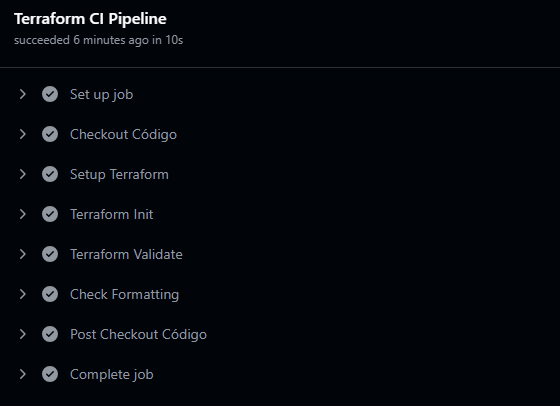
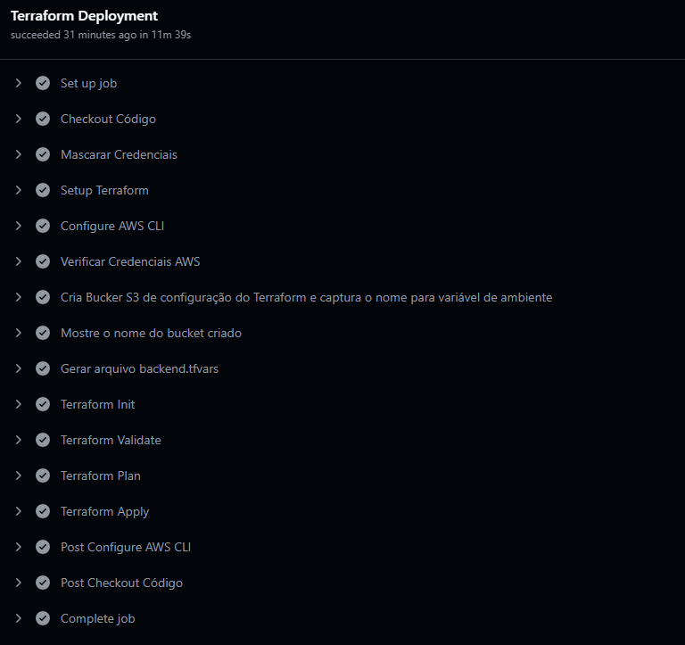

# Repositório dedicado para Infraestrutura (Terraform)
- Inclui a infraestrutura necessária para o desafio 4, com a criação de recursos na AWS
  
  - Infraestrutura como código (IaC) com Terraform
  - Utiliza Github Actions para CI/CD
  - EKS e recursos de rede relacionados, como VPCs, Subnets, Security Groups, etc.
  - Criação de recursos de IAM, como roles, policies, etc.

## Estrutura do Diretório

```plaintext
docs                        - documentações e guias de implementação
src                         - diretório principal com arquivos .tf
└── terraform
    ├── backend.tfvars      - configuração do backend do Terraform
    └── *.tf                - arquivos de configuração do Terraform
```

## Configuração do CI/CD

O repositório possui um workflow de CI/CD configurado com o Github Actions, que realiza a validação e deploy da infraestrutura na AWS.

### CI - Continuous Integration

O workflow de CI é acionado a cada push no repositório, e executa a validação básica da infra com as seguintes etapas:

[Verifique as últimas execuções do workflow de CI Infra nesse link](https://github.com/pos-tech-soat08-03/easyOrder-challenge4-infrastructure/actions/workflows/terraform-ci.yml)



### CD - Continuous Deployment

O workflow de CD é acionado manualmente, e executa o deploy da infraestrutura na AWS com as seguintes etapas:

[Verifique as últimas execuções do workflow de CD Infra nesse link](https://github.com/pos-tech-soat08-03/easyOrder-challenge4-infrastructure/actions/workflows/terraform-cd.yml)



## Subindo a infraestrutura com o Github Actions (Produção)

Para subir a infraestrutura com o Github Actions, siga os passos abaixo:

1. Acesse o repositório do Github e clique na aba `Actions` a partir do  link abaixo:
 https://github.com/pos-tech-soat08-03/easyOrder-challenge4-infrastructure/actions

2. Clique no workflow `Terraform CD - Deploy Infraestrutura` e em seguida clique no botão `Run workflow`

O workflow irá solicitar as chaves de acesso da AWS, que serão obtidas do ambiente do AWS Labs:

```plaintext
aws_access_key_id: <AWS Access Key ID>
aws_secret_access_key: <AWS Secret Access Key>
aws_session_token: <AWS Session Token>
aws_account_id: <AWS Account ID>
aws_region: <AWS Region>
```

Ao final da execução do workflow, a infraestrutura será criada na AWS, e o estado do Terraform será armazenado no bucket criado no S3, cujo nome estará disponível no output do workflow, na etapa `Mostre o nome do bucket criado`
```plaintext
Bucket de Configuração do Terraform: terraform-state-easyorder-'chave uuid'
```

Para acessar o estado do Terraform, acesse o bucket no S3, e o arquivo `easyorder-infra/terraform.tfstate` conterá o estado da infraestrutura criada.

## Subindo a infraestrutura manualmente (Desenvolvimento)

Para subir a infraestrutura manualmente, siga os passos abaixo:

1. Garanta as credenciais da AWS já estejam configuradas no seu ambiente

``` bash
aws configure
```

2. Crie um bucket no S3 para armazenar o estado do Terraform

``` bash
aws s3api create-bucket \
    --bucket terraform-state-easyorder-$(uuidgen | tr -d - | tr '[:upper:]' '[:lower:]' ) \
    --region us-east-1
```

3. Adicione o nome do bucket criado no arquivo `backend.tf` no diretório `src/terraform`:

``` hcl
bucket = "<adicione aqui o nome do bucket>"
key    = "easyorder-infra/terraform.tfstate"
region = "us-east-1"
```

4. Execute os seguintes comandos - a execução precisa ocorrer no diretório `src/terraform`, onde estão os arquivos de configuração HCL do Terraform (.tf):   

    Acesse o diretório do Terraform
    ``` bash
    cd src/terraform
    ```

    Inicialize o Terraform com o backend configurado
    ``` bash
    terraform init -backend-config="backend.tfvars"
    ``` 

    Caso nesta etapa o terraform indique um erro com configuração do backend, execute o  mesmo comando, adicionado a opção `-reconfigure`:
    ``` bash
    terraform init -backend-config="backend.tfvars -reconfigure"
    ``` 

    Valide a configuração do Terraform
    ``` bash
    terraform plan 
    ``` 

    Aplique a configuração do Terraform
    ``` bash
    terraform apply
    ``` 

Com essa sequência de comandos, a infraestrutura será criada, e o estado do Terraform será armazenado no bucket criado no S3.

### Destruindo a infraestrutura

Para destruir a infraestrutura, execute o comando abaixo (no diretório `src/terraform`):
```bash
terraform destroy
```

## Documentação

Para mais informações sobre a arquitetura, verifique o readme dos outros repositorios:

- Microserviços (aplicações):
    - Cliente https://github.com/pos-tech-soat08-03/easyOrder-challenge4-app-cliente
    - Produto https://github.com/pos-tech-soat08-03/easyOrder-challenge4-app-produto
    - Core (Pedido, Pagamento e Preparação) https://github.com/pos-tech-soat08-03/easyOrder-challenge4-app-core

- Serverless (Api Gateway e outros serviços serverless): https://github.com/pos-tech-soat08-03/easyOrder-challenge4-serverless

